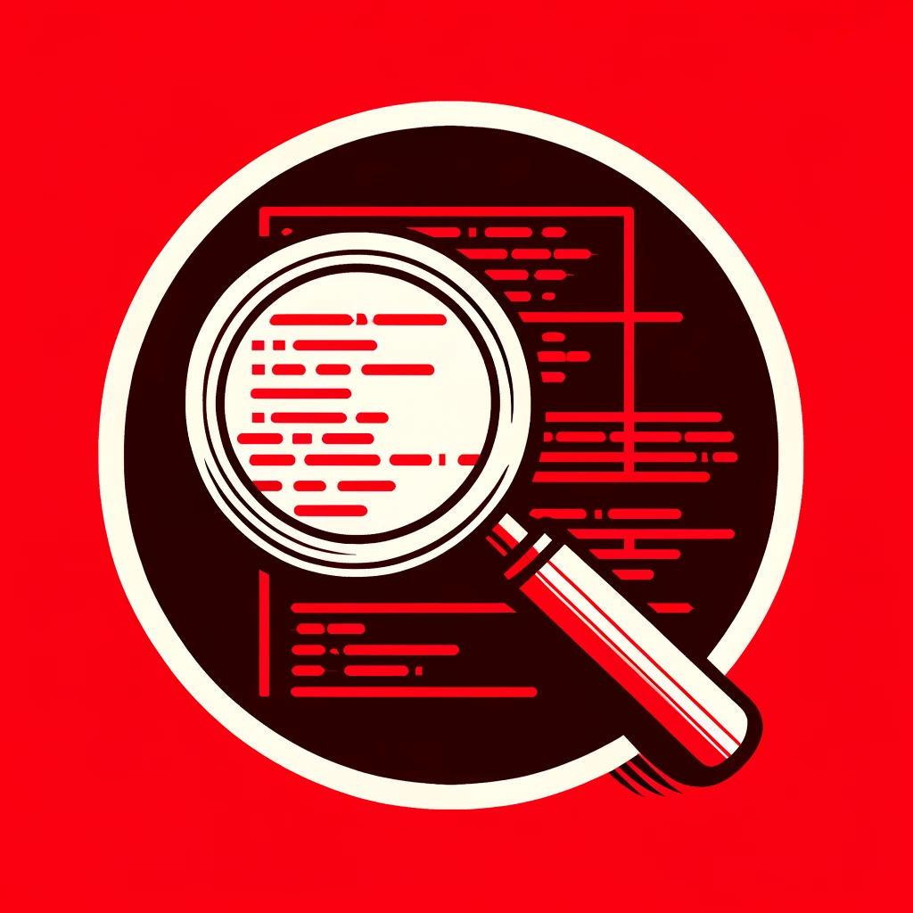
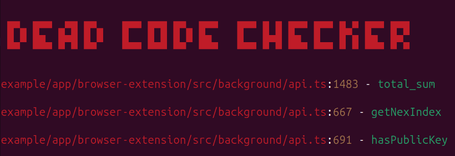

# Dead Code Checker

[](https://opensource.org/licenses/MIT)



`Dead Code Checker` is a tool for finding dead code in your JavaScript or TypeScript project. It helps to ensure a cleaner and more maintainable code base.

## How it works

The tool will recursively scan through your project's source files and generate a report of unused functions and variables.

## Features

- `Variable Detection:` Detects declared variables and verifies their usage.
- `Function Detection:` Identifies declared functions and checks if they are used across your project.
- `Support any framework:` React, Angular, Vue, and more.
- `Detailed Report:` Provides a detailed report of unused functions and variables, including the file and line number where they are declared.

## Usa as CLI

To use Dead Code Checker, simply run the following command in your project directory:

```bash
npx dead-code-checker -f ./src
```

| Option | Args | Description |
| --- | --- | --- |
| -h, --help | null | Show all options. |
| -v, --version | null | Displays the current version of the application. |
| --ci | null | Abort the process when dead code is detected. |
| -f, --folder | folder/app | Folder to be scanned (Default: ./src) |
| -in, --ignoreNames | funcName | Function or variable names to be ignored |
| -if, --ignoreFolders | folderName | Folders to be ignored |

## Example Output



If no unused functions or variables are found, you'll see a message like this:

```bash
✅ No dead code found!
```

## Use in CI/CD

To use Dead Code Checker in CI/CD, you can use the `dead-code-checker` CLI.

**IMPORTANT: Use the `--ci` option to abort the process when dead code is detected.**

```bash
name: Dead Code Checker CI

on: [push]

jobs:
  unit-tests:
    runs-on: ubuntu-latest

    steps:
      - uses: actions/checkout@v4
      - name: Use Node.js
        uses: actions/setup-node@v4
        with:
          node-version: '20.x'
      - run: npm i dead-code-checker -g
      - run: dead-code-checker --ci -f ./src
```

## Use as API

Install the `dead-code-checker` module as a dependency in your project's package.json file.

```bash
npm install dead-code-checker --save
```

Import the `DeadCodeChecker` class from the `dead-code-checker` module.

```javascript
const DeadCodeChecker = require('dead-code-checker');

const checker = new DeadCodeChecker('src/', {
  ignoreNames: ['foo', 'bar'],
  ignoreFolders: ['tests']
});

checker.run();

const report = checker.getReport();

console.log(report);
```

## Contributing

Contributions are welcome!

If you find a bug or have a feature request, please open an issue on GitHub. Feel free to fork the repository and submit pull requests.

## License

MIT License

Copyright (c) 2024 Denisoed

Permission is hereby granted, free of charge, to any person obtaining a copy of this software and associated documentation files (the "Software"), to deal in the Software without restriction, including without limitation the rights to use, copy, modify, merge, publish, distribute, sublicense, and/or sell copies of the Software, and to permit persons to whom the Software is furnished to do so, subject to the following conditions:

The above copyright notice and this permission notice shall be included in all copies or substantial portions of the Software.

THE SOFTWARE IS PROVIDED "AS IS", WITHOUT WARRANTY OF ANY KIND, EXPRESS OR IMPLIED, INCLUDING BUT NOT LIMITED TO THE WARRANTIES OF MERCHANTABILITY, FITNESS FOR A PARTICULAR PURPOSE AND NONINFRINGEMENT. IN NO EVENT SHALL THE AUTHORS OR COPYRIGHT HOLDERS BE LIABLE FOR ANY CLAIM, DAMAGES OR OTHER LIABILITY, WHETHER IN AN ACTION OF CONTRACT, TORT OR OTHERWISE, ARISING FROM, OUT OF OR IN CONNECTION WITH THE SOFTWARE OR THE USE OR OTHER DEALINGS IN THE SOFTWARE.
